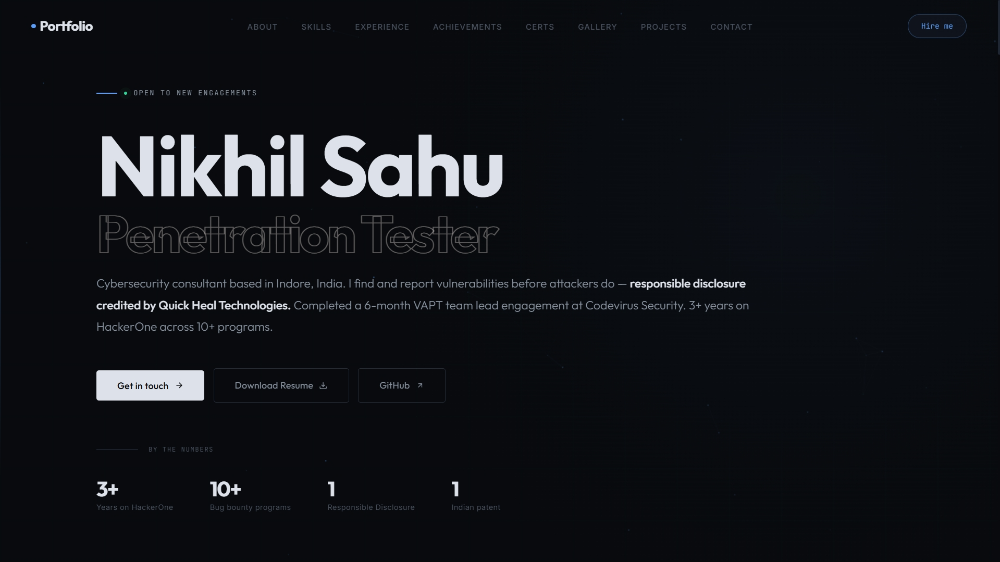

# Nikhil Sahu — Portfolio

This repository contains the source code for my personal portfolio website.

The portfolio highlights my background as a penetration tester, security researcher, and bug bounty hunter, featuring my professional experience, technical skills, achievements, selected projects, and contact information.

## Preview

```
https://nickportfolio-seven.vercel.app
```



---

## About Me

I'm a final-year B.Tech student specializing in Cybersecurity & Digital Forensics with hands-on experience in:

* Penetration Testing
* Vulnerability Assessment & Penetration Testing (VAPT)
* Bug Bounty Hunting
* Malware Analysis
* Web Application Security
* Security Research

My work includes responsible vulnerability disclosure, published cybersecurity research, and contributions to real-world security assessments.

---

## Website Highlights

* Responsive modern design
* Interactive landing page
* Professional experience timeline
* Technical skills overview
* Achievements and research
* Project showcase
* Downloadable resume
* Contact form for professional inquiries

---

## Repository Structure

```text
portfolio/
├── index.html
├── css/
│   └── style.css
├── js/
│   └── script.js
├── resume/
│   └── Nikhil_Sahu_Resume.pdf
├── screenshot.png
└── README.md
```

---

## Author
**Nikhil Sahu** 
- GitHub: [github.com/heynick1337](https://github.com/heynick1337)
- LinkedIn: [linkedin.com/in/sahunikhil01](https://linkedin.com/in/sahunikhil01)
